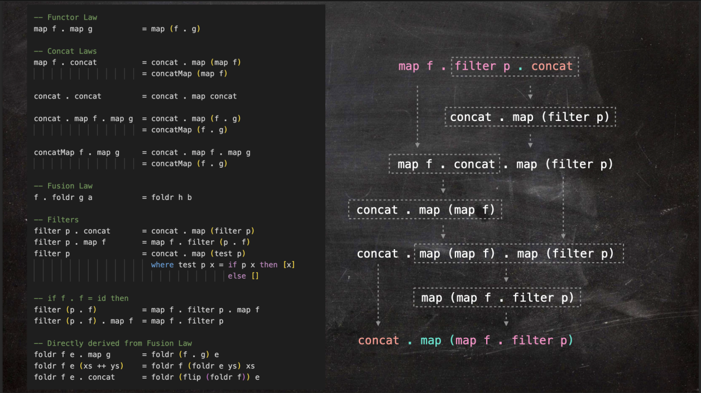

# Mathematical & Functional Foundations of Software Architecture

This repository is a living document and a playground.\
It bridges the gap between **Mathematics**, **Functional Programming**, and **Distributed Systems Architecture**.

The concepts here are heavily inspired by the teachings of [**Dave Rawitat Pulam**][dave-class-reviews].\
Specifically, from his classes:

1. **Mathematics for Working Programmers Day 1-2 (v2.0)**
2. **Haskell Crash Course**

---

## Architectural Insights: From Functional Programming to Distributed Systems

*(Derived from the [Haskell Crash Course 2025][haskell-course-2025])*

At first glance, this course is about learning Haskell.\
We start with Algebraic Data Types and Type Classes.\
We move on to Monadic Parsers and Monad Transformers (`StateT`).\
Finally, we build an Abstract Syntax Tree (AST) to run a terminal-based Maze Game.

But the real goal is mastering **Software Architecture**.

By sticking strictly to Functional Programming principles, the codebase naturally becomes highly decoupled.\
It starts to perfectly mirror large-scale **Distributed Systems** and **Event-Driven Architecture**.

### The Universal Pattern of Decoupling

In traditional Client-Server architectures, receiving a request and executing it are tightly coupled.\
This blocks scalability.

Architects may solve this with a **Message Queue** (like Kafka, RabbitMQ).\
It decouples *IO* (accepting requests) from *Computation (processing requests)*.

We implemented this exact architectural pattern at the code level:

1. **The API Gateway (The Parser):**\
  Our `Parser` is the gateway.\
  It handles messy real-world input, validates syntax, and translates it into our Domain Model.\
  It *never* executes game logic.
2. **The Message Queue (The AST):**\
  Instead of executing commands immediately, the Parser builds an Abstract Syntax Tree (like `Sequence [Forward, TurnLeft]`).\
  This AST is our **Message Payload / Event**.\
  It safely buffers the user's intent in memory.
3. **The Worker Node (The Interpreter):**\
  Our `handleAction` function is the downstream worker.\
  It pulls the AST (the message) and recursively executes it.\
  It computes pure state transitions (`GameState -> GameState`).

### ️ Resilience & Dead Letter Queue (DLQ)

Users will type invalid commands.\
Instead of crashing or throwing a hard error, our `Parser` captures them into the AST as an `Unknown String` node.\

In Distributed Systems, this acts as a **Dead Letter Queue (DLQ)**.\
We route the failed message to the Interpreter.\
The Interpreter inspects the faulty command and responds intelligently (like offering suggestions).\
This gives us **Graceful Degradation** instead of dropping the request.

### Functional Core, Imperative Shell

We use Monad Transformers (`StateT s IO a`) to push side-effects to the very edge of the application.\
This creates an Imperative Shell around our pure Functional Core.\
Our core business rules remain 100% deterministic and testable in isolation.\
We never need to mock databases, consoles, or network boundaries.

---

## Mathematical Foundations

*(Derived from Mathematics for Working Programmers Day 1-2 (v2.0)*

These sections cover the core algebraic structures and category theory required to build predictable systems.

### Curried Functions
*Ref: Day 2, Slides 425-475*

### Generic Functions
*Ref: Day 2, Slides 481-xxx*

### Functional's Laws
The rules of composition and identity that govern predictability.

  

[dave-class-reviews]: https://github.com/rawitat/class-reviews
[haskell-course-2025]: ./haskell/crash-course-2025
[maze-v7]: ./haskell/crash-course-2025/day-8/MazeV7.hs
