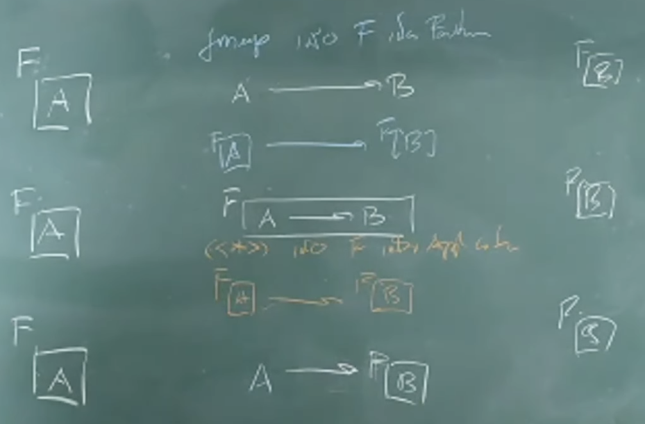

# Day 5 - Functor, Applicative, and Monad



**Concept Mapping from the Board:**

| Type Class | Function Shape | Input Context | Operation |
| :--- | :--- | :--- | :--- |
| **Functor** | `(a -> b)` | `f a` | `fmap` / `<$>` |
| **Applicative** | `f (a -> b)` | `f a` | `apply` / `<*>` |
| **Monad** | `(a -> f b)` | `f a` | `bind` / `>>=` |

---

## Inscribed Shapes Fractal Problem


---

## fmap (`<$>`), apply (`<*>`), and bind (`>>=`)

### 1. Functor: fmap (`<$>`)

We have a **normal function** and a **value in a context**.

```hs
λ> :type (<$>)
(<$>) :: Functor f => (a -> b) -> f a -> f b

λ> :type fmap
fmap :: Functor f => (a -> b) -> f a -> f b
```

**Usage:**

```hs
λ> fmap (*2) [1, 10, 100, 1000]
[2,20,200,2000]

λ> (*2) <$> [1, 10, 100, 1000]
[2,20,200,2000]
```

---

### 2. Applicative: apply (`<*>`)

Now, even the **function is in a context**.

```hs
λ> :type (<*>)
(<*>) :: Applicative f => f (a -> b) -> f a -> f b
```

**The List Context:** Why does it produce a longer list?\
In Functional Programming, a `List` isn't just a container; it represents **non-determinism** or **possibilities**.

When we use `<*>`, we are combining **every possible function** with **every possible value**.

```hs
λ> [(*2), (*3), (*4)] <*> [10, 100, 1000]
[20,200,2000,30,300,3000,40,400,4000]
```

**Let's trace the logic:**

We apply every function on the left to every value on the right (Cartesian Product).

1. Apply `(*2)` to `[10, 100, 1000]`:
    - 10 * 2 = 20
    - 100 * 2 = 200
    - 1000 * 2 = 2000

2. Apply `(*3)` to `[10, 100, 1000]`:
    - 10 * 3 = 30
    - 100 * 3 = 300
    - 1000 * 3 = 3000

3. Apply `(*4)` to `[10, 100, 1000]`:
    - 10 * 4 = 40
    - 100 * 4 = 400
    - 1000 * 4 = 4000

**Conclusion:**

Yes, we get the result applied for **all possible combinations** of values.

---

### 3. Monad: bind (`>>=`)

Let's look at the type signature.

```hs
λ> :type (>>=)
(>>=) :: Monad m => m a -> (a -> m b) -> m b
```

To align with the diagrams above, let's think of `m` as the context `f`.

```hs
(>>=) :: Monad f => f a -> (a -> f b) -> f b
```

**The Problem: Function Composition**

In the "Beautiful World" (Pure functions), composition is easy.


|**Context**|**Function 1**|**Function 2**|**Composition**|
|:---:|:---:|:---:|:---:|
|**Normal**|`f :: A -> B`|`g :: B -> C`|`g . f :: A -> C`|

But in the "Monad World" (Contextual functions), we have a problem.

|**Context**|**Function 1**|**Function 2**|**Composition**|
|---|---|---|---|
|**Monad**|`f :: A -> m B`|`g :: B -> m C`|**???**|

**Why can't we compose them?**

Because the output of `f` is `m B`, but the input of `g` expects just `B`.\
The types do not match.

**Example: The Chain of Failure**

Let's define 3 functions that might fail (return `Nothing` for specific numbers).

```hs
λ> :{
λ| fM :: Int -> Maybe Int
λ| fM n = if n == 42 then Nothing else Just n
λ|
λ| gM :: Int -> Maybe Int
λ| gM n = if n == 58 then Nothing else Just n
λ|
λ| hM :: Int -> Maybe Int
λ| hM n = if n == 61 then Nothing else Just n
λ| :}
```

**The Hard Way: Nested Case (Callback Hell)**

If we want to do `hM(gM(fM(n)))` manually, we must unwrap the value every time.

```hs
λ> :{
λ| hogofM :: Int -> Maybe Int
λ| hogofM n =
λ|   case fM n of
λ|     Nothing -> Nothing
λ|     Just x  ->
λ|       case gM x of
λ|         Nothing -> Nothing
λ|         Just y  -> hM y
λ| :}
```

> **"This is fucking brutal !!!"**

**The Monad Way: Bind (`>>=`)**

The `>>=` operator handles the "unwrapping" logic for us.

**Mathematical Logic for Maybe:**

1. **Failure:** `Nothing >>= f = Nothing` (Stop immediately)
2. **Success:** `Just x >>= f = f x` (Pass value to next function)

Let's define the instance (Standard Library already does this):

```hs
λ> :{
λ| instance Monad Maybe where
λ|   (>>=) :: Maybe a -> (a -> Maybe b) -> Maybe b
λ|   Nothing >>= _ = Nothing
λ|   Just x  >>= f = f x
λ| :}
```

**The Result: Clean Chain**

Now we can chain them like a pipeline.

```hs
λ> Just 40 >>= fM >>= gM >>= hM
Just 40

-- If one fails, the whole chain returns Nothing
λ> Just 42 >>= fM >>= gM >>= hM
Nothing

λ> Just 58 >>= fM >>= gM >>= hM
Nothing
```

#### List Comprehension Is Just Syntactic Sugar for List Monad

The teacher said this was very confusing when he saw it for the first time.

```hs
λ> [1..5] >>= \x -> [x, -x]
[1,-1,2,-2,3,-3,4,-4,5,-5]
```

That one is still okay.\
But look at this one:

```hs
λ> [1, 2] >>= \n -> ['a', 'b'] >>= \ch -> return (n, ch)
[(1,'a'),(1,'b'),(2,'a'),(2,'b')]
```

Does it look familiar?

Let's rewrite it with `do` notation:

```hs
do
  n <- [1, 2]
  ch <- ['a', 'b']
  return (n, ch)
```

Now, see the connection?\
It is exactly the same as List Comprehension:

```hs
λ> [ (n, ch) | n <- [1, 2], ch <- ['a', 'b'] ]
[(1,'a'),(1,'b'),(2,'a'),(2,'b')]
```
---

## Why Applicative Matters: Practical Examples

We can use Applicative to apply **multiple functions** to **multiple values** in a specific context.

```hs
[validateX, validateY, ValidateZ, ...] :: [X -> Bool]
                <*>
[x₁, x₂, x₃, ..., xₙ] :: [X]
```

### 1. Batch Processing (List Context)

This is useful when we want to run **multiple checks** against **multiple inputs** at once (Cartesian Product).

**Example:** Suppose we have `even` and positive (`> 0`) checkers, and a set of input data.

```hs
λ> :{
λ| validations :: [Int -> Bool]
λ| validations = [even, (>0)]

λ| inputs :: [Int]
λ| inputs = [4, -5]
λ| :}
```

When we use `<*>`:

```hs
λ> validations <*> inputs
[True,False,True,False]
```

**Tracing the logic:**

1. `even` applied to `4` -> `True`
2. `even` applied to `-5` -> `False`
3. `(> 0)` applied to `4` -> `True`
4. `(> 0)` applied to `-5` -> `False`

---

### 2. Fail-Fast Validation (Either Context)

Standard `Either` is great for validation, but it stops at the **first error**.

```hs
λ> :{
λ| validateName :: String -> Either String String
λ| validateName "" = Left "Name cannot be empty"
λ| validateName n  = Right n

λ| validateAge :: Int -> Either String Int
λ| validateAge a
λ|   | a < 0     = Left "Age cannot be negative"
λ|   | otherwise = Right a

λ| createUser :: String -> Int -> Either String User
λ| createUser n a = User <$> validateName n <*> validateAge a
λ| :}
```

**Usage:**

```hs
-- Success case
λ> createUser "John" 25
Right (User {name = "John", age = 25})

-- First argument fails
λ> createUser "" 25
Left "Name cannot be empty"

-- Second argument fails
λ> createUser "John" (-1)
Left "Age cannot be negative"

-- Both fail (Returns ONLY the first error)
λ> createUser "" (-1)
Left "Name cannot be empty"
```

**Conclusion:**\
It has a **Fail-Fast** behavior.\
It is the limitation of normal `Either` when we want to see all errors.

